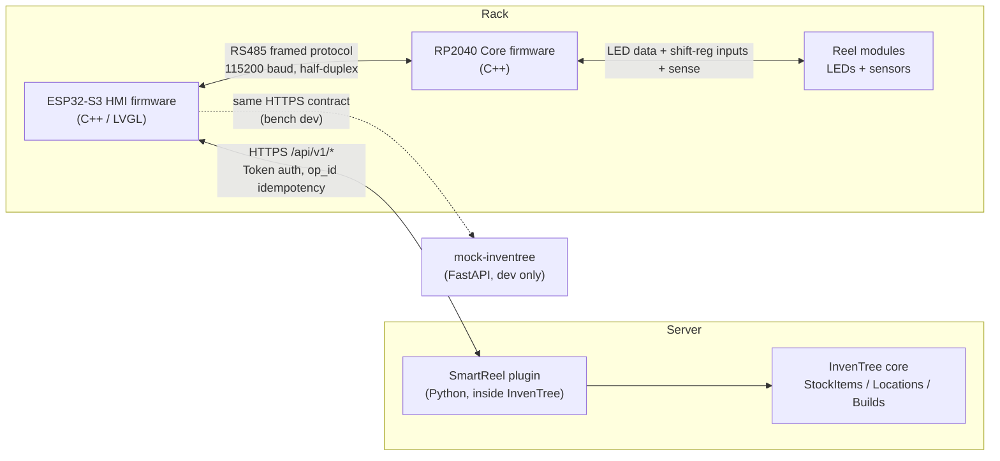

# SmartReel — Software Architecture

Four software components make up SmartReel. Two run on the rack (the HMI and
Core firmware), one runs inside InvenTree (the plugin), and one is a development
stand-in for the plugin (the mock).

## 1. System-level data flow



Two protocols, two boundaries:

- **HMI ↔ Core**: a custom length-prefixed, CRC-16 framed protocol over RS485.
  The HMI is master and polls the Core; the Core reports sensor events and
  drives the LEDs. See [API Reference, Part B](04-api-reference.md#part-b-rs485-wire-protocol).
- **HMI ↔ InvenTree**: a workflow-shaped HTTPS API (`/api/v1/*`) with Token
  auth and `op_id` idempotency. The plugin (or the mock) serves it. See
  [API Reference, Part A](04-api-reference.md#part-a-hmi--plugin-http-api).

## 2. ESP32-S3 HMI firmware (`esp32-hmi/`)

C++ on PlatformIO (pioarduino / IDF 5.3), LVGL 8.4, ArduinoJson 7. Source is
organised by subsystem under `src/`.

### Subsystems

| Subsystem | Responsibility |
|---|---|
| `app/` | Application state and logic: logical-slot model, hardware mirror, LED orchestration, and the InvenTree sync engine. |
| `board/` | Pin map (`board_pins.h`) and the CH422G I/O-expander driver. |
| `display/` | RGB LCD driver and the tearing-free framebuffer pipeline. |
| `touch/` | GT911 capacitive touch driver → LVGL input device. |
| `sensors/` | Optional I²C QR scanner. |
| `rs485/` | RS485 master: frame codec, CRC-16, transactions, background poll. |
| `fw/` | Firmware update: HMI self-OTA from SD, and Core OTA over RS485. |
| `net/` | WiFi manager and the `inv_api` HTTPS client to InvenTree. |
| `storage/` | `config_store` (settings/credentials) and `state_store` (slot contents, jobs) on SD. |
| `ui/` | LVGL screens, the app-state model, screen manager, theme. |
| `util/` | Helpers, including marshalling work onto the LVGL task. |

### Key modules

**`app/inv_sync`** — owns *all* InvenTree traffic. A worker task
(`inv-sync`, priority 1, pinned to APP_CPU) runs a:

- **Health poll** — every 15 s while online, 5 s while offline; sets
  `app_state.online`. "Online" means the last good health check is younger than
  45 s.
- **Rack register** on first successful contact.
- **Reconcile** — `GET /rack` every 60 s and on demand; compares server truth
  to physical sensors (see [ConOps §4.5](01-concept-of-operations.md#45-inventory-reconcile-background)).
- **Pick-job fetch** on demand (throttled ~10 s).
- **Op queue** — a 16-deep retrying queue of mutations (`Assign`, `Pick`,
  `JobPick`, `Clear`, `Anomaly`). Each op carries a unique `op_id`; the queue
  retries up to 20 attempts. A `4xx` is a permanent reject (logged; the next
  reconcile catches any drift). Idempotency makes retries safe.

**`app` state & slot model** (`ui/app_state.h`, `app/slot_map`, `app/hw_mirror`):

- `hw_mirror` is the live cache of per-port module counts and per-module 32-bit
  input words, fed by RS485 poll events.
- `slot_map` is pure logic that turns module counts + divider bits into
  **logical slots**: runs of physical slots merged across pulled dividers,
  numbered by the lowest physical position in the run.
- `app_state` holds the current logical rack (slot → part/qty/state). States:
  `EMPTY`, `OCCUPIED`, `TARGET` (lit for an action), `PICKED`, `WARN`, `ERROR`.
- **Commissioning**: before commit the rack follows live hardware; after commit
  (`rack.committed`) the HMI validates live hardware against the committed
  layout and raises anomalies on deviation.

**`net/inv_api`** — the HTTPS client (details in
[API Reference](04-api-reference.md)):

- Appends `/api/v1/<path>` to the configured base URL.
- **HTTPS-only**: `build_url()` refuses any non-`https://` URL, so the token
  never crosses the wire in cleartext.
- Sends `Authorization: Token <token>`.
- Generates op_ids of the form `hmi-<chip-id>-<millis>-<n>`.
- 4 s request timeout, 2 s connect timeout. Calls are blocking; callers run them
  on a worker task and marshal results back to the LVGL task.
- TLS currently uses `setInsecure()` (self-signed mock); cert pinning (the `f`
  field in the provisioning payload) is parsed but not yet enforced — **TODO**.

**`rs485/`** — the master side of the wire protocol. Frame codec with sync bytes
`0xAA 0x55`, 16-bit length, ADDR/SEQ/TYPE, CRC-16/CCITT-FALSE. A background poll
task issues `POLL` every ~20 ms, pulls queued Core events, dispatches them, and
ACKs them. A single bus mutex serialises transactions.

**`fw/`** — `fw_update` streams an HMI app image from SD into the inactive OTA
partition (Arduino Update), then reboots. `fw_core_update` pushes an RP2040
image to the Core over RS485 in 512-byte chunks with SHA-256 verification.

**`display/`** <a id="display"></a> — RGB LCD at 800×480, 16 MHz pixel clock,
two driver-managed framebuffers in PSRAM. To eliminate tearing, the driver
follows the Waveshare "avoid-tearing" pattern: LVGL renders into the inactive
framebuffer and the flush callback blocks on a vsync semaphore before swapping,
so the panel never scans a half-written frame. The RGB DMA runs on **PRO_CPU**;
all application work (LVGL, inv_sync) is pinned to **APP_CPU** at priority 1 —
any load on PRO_CPU causes visible tearing.

> An HMI graphics/tearing refinement was in progress alongside this
> documentation; the exact tearing-mode details in `display.cpp` may have
> shifted. The principle (vsync-gated double-buffer swap, app work off PRO_CPU)
> holds.

### UI screens (`ui/screens/`)

| Screen | Purpose |
|---|---|
| Home | 5 large action tiles: Load, View, Pick, Rack, Settings. |
| Load | Scan a reel QR, see part details, place into a lit empty slot. |
| View | Browse slots; Find (flash LED) and Pick per part. |
| Rack (dot grid) | Occupancy grid across all ports, colour-coded by state. |
| Pick (list) | Active pick jobs; partial jobs show Resume. |
| Pick (active) | The selected job's items with per-item progress. |
| Settings | Network, firmware update, self-test, slot/divider commissioning. |
| Settings → Network | WiFi + InvenTree URL/token, *Scan setup code* provisioning. |
| Settings → Self-test | Button/LED/reel diagnostics. |
| Settings → Firmware | HMI/Core versions, SD image picker, update. |
| Settings → Slots / Dividers | Commission module counts and divider layout. |

Fonts were deliberately enlarged for the 4.3" screen (the dot grid moved off
Home onto its own Rack screen; "Configure" was renamed "Settings").

### Threading model (summary)

| Task | CPU | Priority | Role |
|---|---|---|---|
| LVGL | APP | 2 | UI refresh, state mutation, event dispatch |
| inv_sync | APP | 1 | health poll, reconcile, op queue |
| rs485 poll | (app) | — | pull Core events every ~20 ms |
| state_store writer | — | — | periodic SD flush of dirty slots/jobs |

All InvenTree calls and RS485 transactions are blocking and run off the LVGL
task; results are posted back via a "dispatch on LVGL" helper.

## 3. RP2040 Core firmware (`core-fw/`)

C++ on PlatformIO (arduino-pico). The Core is the RS485 slave that drives the
reel modules. It is production firmware: `reel_id` = port (0–3), 1–4 chained
modules per port, 32 input bits per module, NeoPXL8 PIO-driven LEDs.

Responsibilities:

- **Serve the RS485 protocol** as a slave at address 0x01: respond to system,
  reel-I/O, LED, and firmware messages; answer the master's ~20 ms `POLL` with
  any queued events.
- **Sample inputs** at 100 Hz (10 ms), 2-sample debounce, and emit
  `INPUT_CHANGE` events when slot/divider bits change.
- **Sample sense** per port (~10 Hz/channel) and emit `REEL_INSERTED` /
  `REEL_REMOVED` when the module count changes.
- **Drive LEDs** via NeoPXL8 with a staging/commit pattern so multi-port updates
  show atomically (no tearing across strips).
- **Handle firmware updates**: stage a new image (Arduino-pico Updater), verify
  SHA-256, commit, and reboot; the OTA bootloader provides A/B rollback.
- **Queue events** in a 32-slot ring with sequence numbers; resend un-ACK'd
  events on each poll (because on a half-duplex bus the slave cannot transmit
  whenever it wants).

Key config (`core-fw/src/config.h`): `N_PORTS=4`, `MAX_MODULES_PER_PORT=4`,
`MODULE_LEDS=16`, `MODULE_INPUT_BITS=32`, `RS485_BAUD=115200`.

## 4. InvenTree plugin (`inventree-plugin/smart_reel/`)

Python plugin (version 0.2.0, slug `smartreel`). Layered:

```
core.py       plugin class: settings, URL routes, web panels
api.py        DRF views — thin HTTP layer, op_id idempotency, auth/error mapping
services.py   domain logic against InvenTree models (StockItem.move, metadata)
static/panel.js   the two web panels (Build Order + provisioning)
```

Mixins: `UrlsMixin` (custom routes under `/plugin/smartreel/`),
`SettingsMixin` (Staging/Pulled location settings + optional HMI URL),
`UserInterfaceMixin` (web panels). Barcode resolution goes through InvenTree's
barcode plugin registry. See [InvenTree Integration](05-inventree-integration.md)
for the full picture (rack identity, sync model, multi-rack).

## 5. Mock InvenTree (`mock-inventree/`)

A FastAPI service that implements the same `/api/v1/*` contract so the HMI can
be developed without a live InvenTree. Serves HTTPS on `:8443` (self-signed
cert under `certs/`), token `dev-token` by default, with the same `op_id`
idempotency (10-minute cache). It also serves a dashboard and a
`GET /_dev/provision` endpoint that prints the `SRPROV1:` payload + QR. It is
single-rack; multi-rack lives only in the real plugin. See
[InvenTree Integration §6](05-inventree-integration.md#6-the-mock-server).

## 6. Where the components agree on the contract

The HMI, the real plugin, and the mock all speak the identical
`/api/v1/*` contract. `docs/user-stories.md` is the behavioural source of
truth; `docs/hmi-plugin-api.md` plus
[API Reference](04-api-reference.md) document the wire shapes.
</content>
